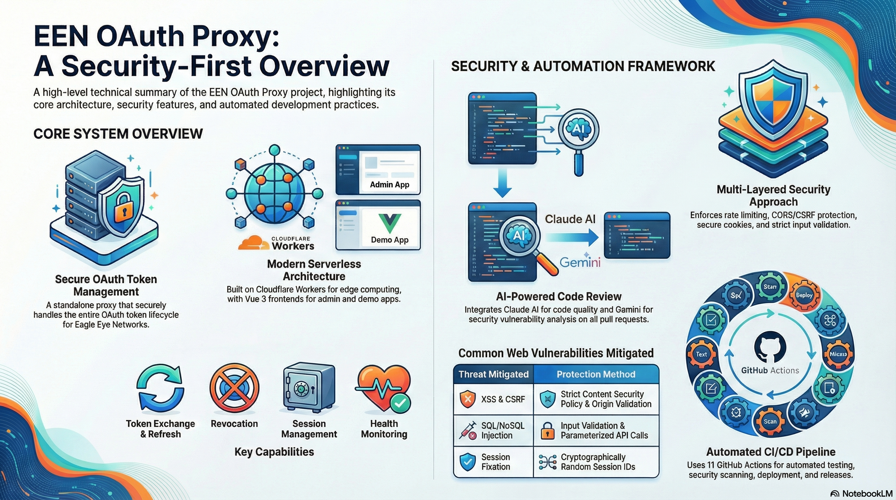

# EEN OAuth Proxy

A standalone OAuth proxy system for Eagle Eye Networks (EEN) consisting of three independent applications.

The repository is intended as example implementation of an OAuth proxy. Users will need to have a CLIENT_ID
and CLIENT_SECRET for OAuth with [Eagleeye Networks (EEN)](https://www.een.com/), and at least one user account. 
See the [Eagleeye Networks Developer Portal](https://developer.eagleeyenetworks.com/) for more details. 

This repository is provided as is without any warranty, functionality guarantee or assurance of availability.
This repository uses EENs services, but it is not associated to EEN.



## Features

### Proxy Features

The OAuth proxy provides secure token management for Eagle Eye Networks authentication:

- **OAuth Token Exchange** - Securely exchanges authorization codes for access tokens, keeping CLIENT_SECRET server-side
- **Token Refresh** - Automatic refresh token management with server-side storage in Cloudflare KV
- **Token Revocation** - Clean logout with EEN token revocation and session cleanup
- **Session Management** - Server-side sessions with configurable TTL and automatic expiration
- **Health Monitoring** - Public health endpoint for uptime monitoring (supports HEAD requests)
- **Multi-Region Support** - Automatically handles EEN regional API endpoints (httpsBaseUrl)

### Security Features

The proxy implements multiple layers of security:

- **Rate Limiting** - Configurable per-endpoint rate limits to prevent abuse:
  - `/health`: 60 requests/minute (default)
  - `/proxy/*`: 30 requests/minute (default)
  - `/admin/*`: 60 requests/minute (default)
  - Unknown clients (no IP identification): 5 requests/minute
  - Configurable via environment variables (`RATE_LIMIT_*`)
- **CORS Protection** - Strict origin validation with configurable allowlist
- **CSRF Protection** - Origin header required for state-changing requests (POST/DELETE)
- **Secure Cookies** - HttpOnly, Secure, SameSite=None session cookies
- **Header-Based Auth** - Supports `Authorization: Bearer <sessionId>` for mobile/cross-site compatibility (ITP bypass). *Note: This requires storing the session ID in client storage (localStorage), which has different security trade-offs compared to HttpOnly cookies.*
- **Input Validation** - Length limits and format validation on all inputs
- **SSRF Protection** - Server-side URL validation with configurable domain allowlist (`ALLOWED_API_DOMAINS`, default: `eagleeyenetworks.com`) prevents attacks via malicious `httpsBaseUrl` values
- **Session ID Security** - Cryptographically random UUIDs with format validation
- **No Secret Exposure** - CLIENT_SECRET and refresh tokens never sent to frontend
- **Security Headers** - X-Content-Type-Options, X-Frame-Options, CSP, HSTS (production)
- **Admin Access Control** - Email-based allowlist for administrative functions
- **Open Redirect Prevention** - Redirect URI validation against allowed origins
- **Timing Attack Prevention** - Constant-time comparison for sensitive operations

### Admin App Features

The admin application provides monitoring and management capabilities:

- **Dashboard Overview** - Real-time proxy health status and version information
- **Session Monitoring** - View count of active user sessions
- **Rate Limit Statistics** - Monitor rate limiting activity across endpoints
- **Session Management** - Remove other users' sessions while preserving your own
- **Emergency Revocation** - Revoke all tokens system-wide (logs out all users)
- **Activity Log** - Real-time log of admin actions with timestamps
- **Dark Mode** - Toggle between light and dark themes (persisted)
- **Resizable Panels** - Adjustable dashboard layout (persisted)
- **Auto-Refresh** - Automatic health check updates with countdown timer
- **Non-Admin Rejection** - Clear error messages for users not in admin list

## Project Structure

```
een-oauth-proxy/
├── proxy/       # Cloudflare Worker OAuth proxy
├── admin/       # Vue 3 management application
└── demo1/       # Vue 3 demo application
```

## Components

### Proxy (`./proxy`)

This is a Cloudflare Worker that handles OAuth authentication with EEN services in a secure way.
It keeps the CLIENT_SECRET secure on the server side, never exposing it to the frontend.
There are also some admin features, such as a health endpoint and session management. 

**Features:**
- OAuth token exchange (`/proxy/getAccessToken`)
- Token refresh (`/proxy/refreshAccessToken`)
- Token revocation (`/proxy/revoke`)
- Admin endpoints for session management

**Deployment:** Cloudflare Workers at `https://your-proxy.your-subdomain.workers.dev`

### Admin App (`./admin`)

A Vue 3 management application for monitoring and administering the OAuth proxy.

**Features:**
- View proxy version and deployment info
- Monitor active sessions
- Remove sessions (except current)
- Emergency token revocation

**Deployment:** GitHub Pages at `https://your-username.github.io/een-oauth-proxy`

### Demo App (`./demo1`)

A Vue 3 demonstration application showing OAuth integration with EEN.

**Features:**
- OAuth login via EEN
- Direct login with access token
- User profile display
- Token refresh and revocation
- Auto-refresh before token expiration

**Deployment:** Local development only (not deployed to production). The demo1 app is tested via `test-demo1-pr.yml` on PRs but has no deployment workflow. Note that demo1 and admin share port 3333 and cannot run simultaneously on the same machine.

## Getting Started

### Prerequisites

- Node.js 20+ (required for Wrangler v4 and Vite 7)
- npm
- Cloudflare account (for proxy deployment)
- GitHub account (for Pages deployment)
- EEN OAuth credentials (CLIENT_ID and CLIENT_SECRET)

### Step 1: Clone and Install Dependencies

```bash
# Clone the repository
git clone https://github.com/your-username/een-oauth-proxy.git
cd een-oauth-proxy

# Install root dependencies (Husky for git hooks)
npm install

# Install proxy dependencies
cd proxy && npm install && cd ..

# Install demo app dependencies
cd demo1 && npm install && cd ..

# Install admin app dependencies
cd admin && npm install && cd ..
```

### Step 2: Configure Environment Variables

Each subfolder has its own `.env.example` file. Copy and configure each one:

**Proxy (`./proxy`):**

The proxy uses two different files for environment variables:
- `.dev.vars` - Used by `wrangler dev` for local development
- `.env` - Used by `scripts/deploy.js` for production deployment

For local development:
```bash
cd proxy
cp .dev.vars.example .dev.vars
```

Edit `proxy/.dev.vars`:
```env
CLIENT_ID=your-een-client-id
CLIENT_SECRET=your-een-client-secret
ADMIN_EMAILS=admin@example.com
ALLOWED_ORIGINS=https://your-username.github.io
ENVIRONMENT=development
```

For production deployment, also create `proxy/.env` with the same values (used by the deploy script to set Cloudflare secrets).

**Mode-Based Environment Loading:**

Both demo1 and admin apps support mode-based environment loading:
- `npm run dev` - Uses local proxy (localhost:8787), loads `.env`
- `npm run dev:prod` - Uses Cloudflare proxy, loads `.env` AND `.env.prod`

The `.env.prod` file should contain `VITE_PROXY_URL` pointing to your deployed Cloudflare Worker.

> **Security Note**: `.env.prod` files are gitignored. Never commit production URLs with sensitive paths or tokens.

**Demo App (`./demo1`):**
```bash
cd demo1
cp .env.example .env
cp .env.prod.example .env.prod  # Optional: for testing with Cloudflare proxy
```

Edit `demo1/.env`:
```env
VITE_EEN_CLIENT_ID=your-een-client-id
VITE_GITHUB_REPO=https://github.com/your-username/een-oauth-proxy
TEST_USER=your-test-email@example.com
TEST_PASSWORD=your-test-password
```

Edit `demo1/.env.prod` (optional, for `npm run dev:prod`):
```env
VITE_PROXY_URL=https://your-proxy.your-subdomain.workers.dev
```

**Admin App (`./admin`):**
```bash
cd admin
cp .env.example .env
cp .env.prod.example .env.prod  # Optional: for testing with Cloudflare proxy
```

Edit `admin/.env`:
```env
VITE_EEN_CLIENT_ID=your-een-client-id
VITE_GITHUB_REPO=https://github.com/your-username/een-oauth-proxy
ADMIN_TEST_USER=your-admin-email@example.com
ADMIN_TEST_PASSWORD=your-admin-password
```

Edit `admin/.env.prod` (optional, for `npm run dev:prod`):
```env
VITE_PROXY_URL=https://your-proxy.your-subdomain.workers.dev
```

### Step 3: Create Cloudflare KV Namespace

The proxy uses Cloudflare KV to store session data. Create a namespace:

```bash
cd proxy
npx wrangler kv namespace create EEN_OAUTH_SESSIONS
```

This will output something like:
```
🌀 Creating namespace with title "EEN_OAUTH_SESSIONS"
✨ Success!
To access your new KV Namespace in your Worker, add the following snippet to your configuration file:
[[kv_namespaces]]
binding = "EEN_OAUTH_SESSIONS"
id = "b6ac1ea749dc43669fe0696903cb39f7"
```

Update `proxy/wrangler.toml` with the namespace ID from the output:
```toml
[[kv_namespaces]]
binding = "EEN_OAUTH_SESSIONS"
id = "abcd1234..."  # Use your actual ID
```

### Step 4: Run Locally

> **Note:** The Demo and Admin apps both use port 3333 to match the EEN OAuth redirect URI configuration. They **cannot run simultaneously** on the same machine. To test both locally, run one app locally and access the other via the hosted GitHub Pages version.

Open two terminal windows:

**Terminal 1 - Proxy (port 8787):**
```bash
cd proxy
npm run dev
```

**Terminal 2 - Demo App OR Admin App (port 3333):**
```bash
# Run demo app
cd demo1
npm run dev

# OR run admin app (stop demo first with: npm run stop)
cd admin
npm run dev
```

Now you can access:
- Local App: http://127.0.0.1:3333
- Proxy: http://localhost:8787

To switch between apps locally:
```bash
cd demo1 && npm run stop   # Stop current app on port 3333
cd admin && npm run dev    # Start the other app
```

### Step 5: Run Tests

See the [Testing](#testing) section below for comprehensive test documentation.

## Testing

This project includes comprehensive test suites for both the proxy and the frontend applications.

### Proxy Tests (Vitest + Cloudflare Workers)

The proxy includes unit, integration, and security tests using Vitest with the Cloudflare Workers test pool.

```bash
cd proxy
npm test           # Run all tests
npm run test:watch # Run tests in watch mode
```

**Test Files:**

| File | Description | Tests |
|------|-------------|-------|
| `test/cors.test.js` | CORS validation and origin checking | Origin allowlist, preflight requests, 404 handling |
| `test/oauth.test.js` | OAuth endpoint testing | Token exchange, refresh, revocation |
| `test/admin.test.js` | Admin endpoint testing | Authentication, authorization, session management |
| `test/security.test.js` | Security vulnerability tests | Injection attacks, session manipulation, CORS bypass |
| `test/integration.test.js` | Integration tests | EEN API communication, session persistence |

**Security Tests Include:**
- SQL/NoSQL injection attempts
- XSS payload handling
- Command injection attempts
- Path traversal attacks
- Session ID manipulation
- CORS bypass attempts
- HTTP method validation
- Header injection prevention
- Rate limiting awareness
- JSON parsing edge cases

### Admin App Tests (Playwright)

The admin app includes end-to-end tests using Playwright.

```bash
cd admin
npm test                    # Run all tests
npm run test:ui             # Run with Playwright UI
npx playwright test --debug # Run in debug mode
```

**Test Files:**

| File | Description |
|------|-------------|
| `tests/admin-login.spec.js` | Login flow, health checks, logout |
| `tests/admin-destructive.spec.js` | Admin operations (local proxy only) |

**Test Configuration:**

The admin tests require environment variables in `admin/.env`:
```env
VITE_EEN_CLIENT_ID=your-een-client-id
ADMIN_TEST_USER=your-admin-email@example.com
ADMIN_TEST_PASSWORD=your-admin-password
TEST_USER=your-non-admin-email@example.com  # Optional: for rejection tests
TEST_PASSWORD=your-non-admin-password
```

**Important:** Destructive tests (remove sessions, revoke all) only run against local proxy (`localhost` or `127.0.0.1`) to protect production data.

### Demo App Tests (Playwright)

The demo app includes end-to-end tests using Playwright.

```bash
cd demo1
npm test                    # Run all tests
npm run test:ui             # Run with Playwright UI
```

**Test Files:**

| File | Description |
|------|-------------|
| `tests/happy-path.spec.js` | Complete login/logout flow |
| `tests/auth-flows.spec.js` | Authentication edge cases |

**Test Configuration:**

The demo tests require environment variables in `demo1/.env`:
```env
VITE_EEN_CLIENT_ID=your-een-client-id
TEST_USER=your-test-email@example.com
TEST_PASSWORD=your-test-password
```

### Running All Tests

From the root directory:

```bash
# Run all tests (proxy API + demo Playwright + admin Playwright)
npm test

# This script:
# 1. Starts the proxy locally
# 2. Runs proxy API tests (Vitest)
# 3. Starts demo1 app, runs Playwright tests, stops app
# 4. Starts admin app, runs Playwright tests, stops app
# 5. Cleans up all processes
```

Run individual test suites:

```bash
# Proxy API tests only (no server needed)
npm run test:proxy

# Demo Playwright tests (requires proxy running)
npm run test:demo

# Admin Playwright tests (requires proxy running)
npm run test:admin
```

Or run directly in each folder:

```bash
cd proxy && npm test
cd demo1 && npm test
cd admin && npm test
```

### Test Environment Setup

1. **Proxy must be running** for Playwright tests:
   ```bash
   cd proxy && npm run dev
   ```

2. **Test credentials** must be configured:
   - `TEST_USER`: A valid EEN account email
   - `TEST_PASSWORD`: The account password
   - The test user email must be in `ADMIN_EMAILS` for admin tests

3. **Local proxy for destructive tests**:
   - Admin destructive tests skip automatically if not using local proxy
   - This prevents accidental data loss in production

## Deployment

### Deploy Proxy to Cloudflare

Before deploying, ensure your `wrangler.toml` has the KV namespace configured.

```bash
cd proxy
npm run deploy
```

Or from root:
```bash
npm run deploy:proxy
```

The deploy script will:
1. Deploy the worker to Cloudflare
2. Set secrets (CLIENT_ID, CLIENT_SECRET, ADMIN_EMAILS, ALLOWED_ORIGINS)
3. Store the version in KV

### Deploy Apps to GitHub Pages

Update the `.env` files for production:

**admin/.env:**
```env
VITE_PROXY_URL=https://your-proxy.your-subdomain.workers.dev
VITE_REDIRECT_URI=https://your-username.github.io/een-oauth-proxy
```

**Important:** The `VITE_REDIRECT_URI` must **exactly match** what's registered in your EEN OAuth application configuration, including the presence or absence of trailing slashes and paths. If not set, it defaults to `window.location.origin` (e.g., `https://your-username.github.io`).

Then deploy:
```bash
npm run deploy:pages
```

Or directly:
```bash
./scripts/deploy-pages.sh
```

## CI/CD and GitHub Actions

### Branch Strategy

This project uses two main branches:

| Branch | Purpose |
|--------|---------|
| `develop` | Active development branch. All feature work happens here. |
| `production` | Production-ready code. Protected branch with required checks. |

### Branch Protection

The `production` branch is protected with the following rules:

- **Required status checks must pass before merging:**
  - `review` - Claude Code AI review
  - `test` - Playwright tests with local proxy
  - `Analyze (javascript-typescript)` - CodeQL security analysis
- **Require pull request before merging** - Direct pushes to production are blocked
- **Administrators are subject to these rules** - No bypass allowed

### GitHub Actions Workflows

| Workflow | Trigger | Description |
|----------|---------|-------------|
| `pr-review.yml` | PR to production/develop | AI code review using Claude Code Action |
| `pr-review-gemini.yml` | PR to production/develop | AI security review using Google Gemini |
| `test-admin-pr.yml` | PR to production | Runs admin Playwright tests against local proxy |
| `test-demo1-pr.yml` | PR to production | Runs demo1 Playwright tests against local proxy |
| `validate-branch-protection.yml` | PR to production/develop | Validates branch naming conventions |
| `check-proxy-version.yml` | PR to production (proxy/**) | Checks if proxy version differs from deployed |
| `codeql.yml` | PR to production | Security vulnerability scanning |
| `deploy-proxy.yml` | Push to production (proxy/**) or manual | Deploys proxy to Cloudflare Workers with rollback |
| `deploy-admin.yml` | Push to production | Deploys admin app to GitHub Pages |
| `test-admin-deployed.yml` | After deploy | Tests the deployed admin app |
| `release.yml` | After deployed tests pass | Creates GitHub release with version tag |
| `sync-develop.yml` | PR merged to production | Auto-syncs develop branch with production |

### Workflow Details

**PR Test Workflow (`test-admin-pr.yml`):**
- Starts a local wrangler proxy with test credentials
- Runs full Playwright test suite against the local proxy
- Required to pass before merging to production

**Claude Code Review (`pr-review.yml`):**
- Uses `anthropics/claude-code-action@v1` for AI-powered code review
- Reviews code quality, potential bugs, security issues, and best practices
- Posts review comments on the pull request

**Gemini Security Review (`pr-review-gemini.yml`):**
- Uses Google Gemini API for security-focused code review
- Focuses on security vulnerabilities, input validation, error handling, and reliability
- Provides risk assessment (Low/Medium/High/Critical) with recommended actions
- Complements Claude review with security-specific analysis
- Both reviews use custom prompts from `.github/claude-review.md`

**CodeQL Analysis (`codeql.yml`):**
- Scans JavaScript/TypeScript for security vulnerabilities
- Runs on PRs to production and can be triggered manually

**Branch Sync (`sync-develop.yml`):**
- Automatically merges production back into develop after PR merges
- Prevents develop from becoming out-of-sync with production
- **Note:** After a PR is merged, run `git pull` locally before making new commits

**Proxy Deployment (`deploy-proxy.yml`):**

Automatically deploys the proxy to Cloudflare Workers with version checking and automatic rollback on failure.

*Triggers:*
- **Automatic:** Push to `production` branch when `proxy/**` files change
- **Manual:** Workflow dispatch with optional inputs

*Workflow Steps:*
1. Compare `proxy/package.json` version with deployed `/health` version
2. Skip deployment if versions match (prevents redundant deploys)
3. Capture current deployment version ID (for potential rollback)
4. Deploy worker to Cloudflare
5. Set Cloudflare secrets (CLIENT_ID, CLIENT_SECRET, etc.)
6. Store deploy version in KV
7. Wait 15 seconds for propagation
8. Run verification tests against deployed proxy
9. **On test failure: Automatically rollback to previous version**
10. Verify rollback with health check
11. Send Slack notification (success or failure with rollback status)

*Manual Trigger Inputs:*
| Input | Description |
|-------|-------------|
| `skip_verification` | Skip post-deployment tests (use with caution) |
| `force_deploy` | Deploy even if versions match (use with caution - bypasses safety check) |

*Automatic Rollback:*
- If verification tests fail after deployment, the workflow automatically rolls back to the previous version
- Rollback uses `wrangler versions deploy` to restore the prior deployment
- After rollback, a health check verifies the rolled-back version is working
- Slack notification indicates "(rolled back to [version])" when rollback occurs
- If no previous version exists (first deployment), rollback is skipped with appropriate messaging
- The workflow still reports as failed to alert of the issue

*Version Checking:*
- Compares the version in `proxy/package.json` with the version reported by `/health` endpoint
- Supports semver with pre-release tags (e.g., `1.0.0-beta.1`)
- If versions match, deployment is skipped (logs "Deployment Skipped" in summary)
- Use `force_deploy: true` to override (use with caution - for redeploying same version)

**Deployment Pipeline:**
1. PR merged to `production` triggers `deploy-admin.yml` and `deploy-proxy.yml`
2. Proxy deployed to Cloudflare Workers (with rollback safety)
3. Admin app deployed to GitHub Pages
4. `test-admin-deployed.yml` runs tests against deployed app
5. On success, `release.yml` creates a new GitHub release
6. Slack notifications sent for deployments and releases

### Required GitHub Secrets

Configure these secrets in your repository settings (Settings > Secrets and variables > Actions > **Secrets** tab):

| Secret | Description | Used By |
|--------|-------------|---------|
| `CLOUDFLARE_API_TOKEN` | Cloudflare API token for Workers deployment (see below) | Proxy deployment workflow |
| `CLOUDFLARE_ACCOUNT_ID` | Cloudflare account ID (from dashboard URL) | Proxy deployment workflow |
| `VITE_EEN_CLIENT_ID` | EEN OAuth Client ID | PR tests, proxy deployment |
| `EEN_CLIENT_SECRET` | EEN OAuth Client Secret | PR tests, proxy deployment |
| `ADMIN_EMAILS` | Comma-separated admin email addresses | Proxy deployment |
| `ALLOWED_ORIGINS` | Comma-separated CORS allowed origins | Proxy deployment |
| `ALLOWED_API_DOMAINS` | Comma-separated allowed API domains for SSRF protection | Proxy deployment |
| `REFRESH_TOKEN_TTL` | Session TTL in seconds (default: 86400) | Proxy deployment |
| `ADMIN_TEST_USER` | Test admin user email (must be in ADMIN_EMAILS) | Playwright tests |
| `ADMIN_TEST_PASSWORD` | Test admin user password | Playwright tests |
| `TEST_USER` | Test user email (must not be in ADMIN_EMAILS) | Playwright tests |
| `TEST_PASSWORD` | Test user password | Playwright tests |
| `ANTHROPIC_API_KEY` | Anthropic API key for Claude Code reviews | Claude PR review workflow |
| `GEMINI_API_KEY` | Google Gemini API key for security reviews | Gemini PR review workflow |
| `SLACK_WEBHOOK` | Slack incoming webhook URL for notifications | Deploy and release workflows |

**Cloudflare API Token:**

To create a Cloudflare API token for automated proxy deployment:

1. Go to [Cloudflare Dashboard](https://dash.cloudflare.com) → Profile → API Tokens
2. Click "Create Token"
3. Use the "Edit Cloudflare Workers" template or create a custom token with:
   - Account → Workers Scripts → Edit
   - Account → Workers KV Storage → Edit
4. Scope the token to your account
5. Copy the token value for `CLOUDFLARE_API_TOKEN`

The `CLOUDFLARE_ACCOUNT_ID` can be found in your Cloudflare dashboard URL:
`https://dash.cloudflare.com/<ACCOUNT_ID>/workers/...`

**Upload Secrets Script:**

A convenience script is provided to upload all secrets from your local `proxy/.env` file to GitHub:

```bash
./scripts/upload-github-secrets.sh
```

This script reads secrets from `proxy/.env` and uploads them to GitHub using the `gh` CLI. It handles the name mapping between local environment variables and GitHub secret names (e.g., `CLIENT_ID` → `VITE_EEN_CLIENT_ID`).

Requirements:
- GitHub CLI (`gh`) must be installed and authenticated
- `proxy/.env` must contain the required secrets

### Required GitHub Variables

Configure these variables in your repository settings (Settings > Secrets and variables > Actions > **Variables** tab):

| Variable | Description | Example |
|----------|-------------|---------|
| `VITE_PROXY_URL` | URL of the deployed Cloudflare proxy | `https://your-proxy.workers.dev` |
| `VITE_REDIRECT_URI` | OAuth redirect URI (admin app URL) | `https://your-username.github.io/een-oauth-proxy` |

**Important:** These must be set as **Variables** (not Secrets) because:
- The `test-admin-deployed.yml` workflow uses `${{ vars.VITE_PROXY_URL }}` to test against the production proxy
- Without this variable, tests fall back to `localhost:8787` which doesn't exist in GitHub Actions
- The workflow will fail early with a clear error if this variable is not configured

### Slack Notifications

The project sends Slack notifications for:

1. **Deployments** - When admin app is deployed to GitHub Pages
2. **Releases** - When a new release is created

To configure Slack notifications:

1. Create a Slack app at https://api.slack.com/apps
2. Enable "Incoming Webhooks" for your app
3. Create a webhook for your desired channel
4. Add the webhook URL as `SLACK_WEBHOOK` in GitHub repository secrets

Notifications include:
- Version numbers (admin and proxy)
- Deployment/release timestamp
- Links to the deployed app and release page
- Action buttons for quick access

### Additional Code Review (Optional)

**GitHub Copilot:**
- Can be enabled via repository rulesets
- Provides additional AI-powered code review comments
- Note: Copilot reviews are informational only and don't block merges

To enable Copilot reviews:
1. Go to Settings > Rules > Rulesets
2. Create/edit a ruleset for the production branch
3. Enable "Request pull request review from GitHub Copilot"

### Claude Code PR Skill

This project includes a Claude Code skill for automating the PR creation and review process. The skill is defined in `.claude/skills/PR-and-check/SKILL.md`.

**What it does:**
1. Validates you're on a feature branch (not `develop` or `production`)
2. Checks for existing PRs on the branch
3. Runs all test suites locally (proxy, admin, demo1)
4. Creates a well-formatted PR to `develop` with test results and version numbers
5. Monitors the automated code review workflow and reports recommendations

**Usage:**
```bash
# In Claude Code CLI, invoke the skill:
/PR-and-check
```

**Requirements:**
- Must be on a feature branch
- Local proxy must be available for integration tests
- GitHub CLI (`gh`) must be authenticated

## Environment Variables Reference

### Proxy Environment Variables

**Note:** The proxy does NOT use the `VITE_` prefix because it's a Cloudflare Worker (not a Vite app). Wrangler reads these directly.

| Variable | Description | Example |
|----------|-------------|---------|
| `CLIENT_ID` | EEN OAuth Client ID | `YOUR-CLIENT-ID` |
| `CLIENT_SECRET` | EEN OAuth Client Secret | `your-secret` |
| `ADMIN_EMAILS` | Comma-separated admin emails | `admin@example.com` |
| `ALLOWED_ORIGINS` | Comma-separated CORS origins | `https://example.com` |
| `ALLOWED_API_DOMAINS` | Comma-separated allowed API domains for SSRF protection | `eagleeyenetworks.com` |
| `ENVIRONMENT` | `development` or `production` | `development` |
| `REFRESH_TOKEN_TTL` | Session TTL buffer in seconds (see below) | `86400` |
| `RATE_LIMIT_ENABLED` | Enable/disable rate limiting | `true` (default) |
| `RATE_LIMIT_WINDOW` | Rate limit window in seconds | `60` (default) |
| `RATE_LIMIT_HEALTH` | Max requests per window for `/health` | `60` (default) |
| `RATE_LIMIT_OAUTH` | Max requests per window for `/proxy/*` | `30` (default) |
| `RATE_LIMIT_ADMIN` | Max requests per window for `/admin/*` | `60` (default) |
| `RATE_LIMIT_UNKNOWN` | Max requests per window for unidentified clients | `5` (default) |

**Session TTL and Refresh Token Expiration:**

The proxy stores sessions in Cloudflare KV with a TTL calculated as: `access_token_expires_in + REFRESH_TOKEN_TTL`. Since EEN does not expose the refresh token expiration time in its API response, the `REFRESH_TOKEN_TTL` variable provides a configurable buffer.

- **Default:** 86400 seconds (1 day)
- **Minimum:** 0 seconds
- **Maximum:** 2592000 seconds (30 days)
- **Purpose:** Keeps sessions alive long enough for users to refresh their tokens
- **If too short:** Users may be forced to re-login even though their refresh token is still valid at EEN
- **If too long:** Stale sessions remain in KV storage (minimal impact, just wasted space)

Values outside the min/max range are automatically clamped. Adjust this value based on your EEN OAuth application's refresh token lifetime. For longer-lived refresh tokens (e.g., 7 days), consider setting `REFRESH_TOKEN_TTL=604800`.

**Files:**
- `proxy/.dev.vars` - Local development (used by `wrangler dev`)
- `proxy/.env` - Production deployment (used by `scripts/deploy.js`)

### App Environment Variables

| Variable | Description | Example |
|----------|-------------|---------|
| `VITE_PROXY_URL` | URL of the OAuth proxy | `http://localhost:8787` |
| `VITE_EEN_CLIENT_ID` | EEN OAuth Client ID | `YOUR-CLIENT-ID` |
| `VITE_EEN_AUTH_URL` | EEN OAuth authorize URL | `https://auth.eagleeyenetworks.com/oauth2/authorize` |
| `VITE_REDIRECT_URI` | OAuth callback URL (must exactly match EEN config) | `http://127.0.0.1:3333` |
| `VITE_GITHUB_REPO` | GitHub repository URL for version links in the app footer | `https://github.com/your-username/een-oauth-proxy` |

## API Endpoints

### Public Endpoints (No Authentication Required)

| Method | Endpoint | Description |
|--------|----------|-------------|
| GET, HEAD | `/health` | Health check - returns status, version, and timestamp. HEAD method supported for monitoring services like UptimeRobot. |

### OAuth Endpoints

| Method | Endpoint | Auth Required | Description |
|--------|----------|---------------|-------------|
| POST | `/proxy/getAccessToken` | No (uses OAuth code) | Exchange authorization code for access token. Returns access token and `sessionId` (in body), stores refresh token server-side. |
| POST | `/proxy/refreshAccessToken` | Session cookie OR Header | Refresh access token using stored refresh token. |
| POST | `/proxy/revoke` | Session cookie OR Header | Revoke tokens at EEN and clear server-side session. |

### Admin Endpoints (Admin User Required)

These endpoints require:
1. A valid session (`sessionId`) provided via `Cookie` OR `Authorization: Bearer <sessionId>` header
2. The session's `userEmail` must be in the `ADMIN_EMAILS` environment variable

| Method | Endpoint | Description |
|--------|----------|-------------|
| GET | `/admin/version` | Get proxy version and deploy time |
| GET | `/admin/sessionsCount` | Count active sessions stored in KV |
| GET | `/admin/rateLimitStats` | Get rate limiting statistics by client IP |
| DELETE | `/admin/removeSessions` | Remove all sessions except current user's session |
| POST | `/admin/revokeAll` | Emergency: revoke all tokens at EEN and delete all sessions |

**Authentication Error Responses:**
- `401 Unauthorized` - No session cookie or session expired/invalid
- `403 Forbidden` - User is authenticated but email is not in `ADMIN_EMAILS` list

## Version Management

This project uses Husky to automatically increment the patch version in each subfolder's `package.json` when files in that subfolder are committed.

For example, if you modify files in `proxy/`, the `proxy/package.json` version will be incremented from `0.1.0` to `0.1.1` on commit.

## Documentation Generation

This project includes tooling to generate presentation slides from a template:

```bash
# Generate PRESENTATION.md and PRESENTATION.html
npm run build:presentation
```

The script:
- Detects the repository URL from git remote (supports SSH and HTTPS)
- Injects the URL into the template placeholders
- Generates Marp-compatible Markdown that can be converted to HTML slides

Files:
- `scripts/generate-presentation.js` - Generation script with URL sanitization
- `scripts/PRESENTATION_TEMPLATE.md` - Template file with `{{REPO_URL}}` placeholders
- `PRESENTATION.md` / `PRESENTATION.html` - Generated output (gitignored)

Run tests for the generation script:
```bash
node scripts/generate-presentation.test.js
```

## Security

- **CLIENT_SECRET** is never exposed to the frontend
- **Refresh tokens** are stored server-side only in Cloudflare KV
- **Session cookies** are HttpOnly, Secure, and SameSite=None
- **Header-Based Auth** is supported for mobile clients where third-party cookies are blocked (ITP). This mechanism uses `localStorage` on the client, which is accessible to JavaScript. While necessary for functionality in some environments, it relies on XSS protection (CSP, input sanitization) rather than the HttpOnly flag for security.
- **CORS validation** on all proxy requests
- **SSRF protection** on `httpsBaseUrl` from EEN token responses - only domains configured in `ALLOWED_API_DOMAINS` (default: `eagleeyenetworks.com`) are allowed, preventing attackers from redirecting API calls to internal services or cloud metadata endpoints
- **Admin endpoints** require email verification against allowlist
- **Automatic token expiration** via KV TTL

### Token Lifecycle

**Token Refresh (`/proxy/refreshAccessToken`):**
- Issues a new access token using the stored refresh token
- Does **NOT** invalidate existing access tokens
- Both old and new access tokens remain valid until their natural expiration
- This is standard OAuth 2.0 behavior - access tokens are stateless JWTs

**Token Revocation (`/proxy/revoke`):**
- Revokes the refresh token at EEN's OAuth server
- Clears the server-side session from KV storage
- EEN may invalidate associated access tokens upon refresh token revocation
- After revocation, users cannot refresh tokens or obtain new access tokens

**Important:** Access tokens are short-lived (typically 1 hour) and validated directly by EEN's API. The proxy does not track or validate access tokens - it only manages refresh tokens server-side.

### Content Security Policy (CSP) and Proxy URLs

Both the admin and demo1 applications implement a Content Security Policy (CSP) to protect against Cross-Site Scripting (XSS) attacks. The CSP includes a `connect-src` directive that controls which URLs the application can make fetch requests to.

**How it works:**
- The CSP is automatically configured at build time based on the `VITE_PROXY_URL` environment variable
- The CSP always includes `localhost:8787` and `127.0.0.1:8787` for local development compatibility
- If `VITE_PROXY_URL` is set and different from localhost, it is automatically added to the CSP
- A Vite plugin (`vite-plugin-csp.js`) handles this injection automatically

**Runtime Proxy Selection:**
- Both applications allow users to select a proxy URL at runtime via a dropdown on the login page
- The dropdown only shows options that are allowed by the CSP:
  - `localhost:8787` (always available in development)
  - The `VITE_PROXY_URL` value (if configured)
- Users can switch between these options at runtime without issues

**Important Notes:**
- **CSP is static**: The CSP is set at build time and cannot be changed at runtime
- **Rebuild required**: If you need to use a different proxy URL than what was set during build, you must rebuild the application with the new `VITE_PROXY_URL` set
- **Transparent for common cases**: If you're using `localhost:8787` or the configured `VITE_PROXY_URL`, everything works transparently - no special configuration needed

**Example Build Commands:**

```bash
# Build with localhost proxy (default)
cd admin && npm run build

# Build with Cloudflare proxy
cd admin && VITE_PROXY_URL=https://your-proxy.workers.dev npm run build

# Build with custom proxy
cd admin && VITE_PROXY_URL=https://custom-proxy.example.com npm run build
```

The same applies to the `demo1` application.

## Troubleshooting

### "Forbidden: Invalid origin" error
- Check that the request origin is in `ALLOWED_ORIGINS`
- In development, only `http://127.0.0.1:3333` is automatically allowed (to match EEN OAuth redirect URI)
- **Security Note**: Including `http://127.0.0.1:3333` in production `ALLOWED_ORIGINS` is safe because:
  - Browsers enforce the Same-Origin Policy, preventing remote sites from making requests that appear to come from localhost
  - Only code actually running on localhost can send requests with a `127.0.0.1` origin
  - This allows developers to test against the production proxy while developing locally

### "Admin access required" error
- Ensure your email is in the `ADMIN_EMAILS` list
- The email must match exactly (case-insensitive)

### KV namespace not found
- Run `npx wrangler kv namespace create EEN_OAUTH_SESSIONS`
- Update `wrangler.toml` with the namespace ID

### OAuth callback fails
- Verify `VITE_REDIRECT_URI` **exactly matches** your EEN OAuth app configuration
- **Important:** The redirect URI must match character-for-character, including trailing slashes. For example, if EEN has `http://127.0.0.1:3333` registered (without trailing slash), your `VITE_REDIRECT_URI` must also be `http://127.0.0.1:3333` (not `http://127.0.0.1:3333/`)
- If you see `[invalid_request] OAuth 2.0 Parameter: redirect_uri`, the URIs don't match exactly
- Check that the proxy is running and accessible

## License

MIT
